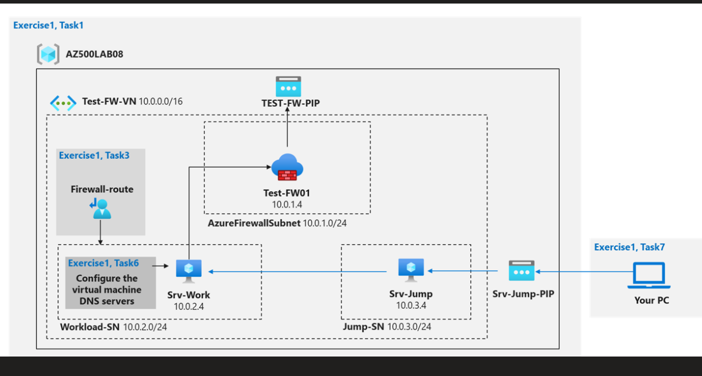
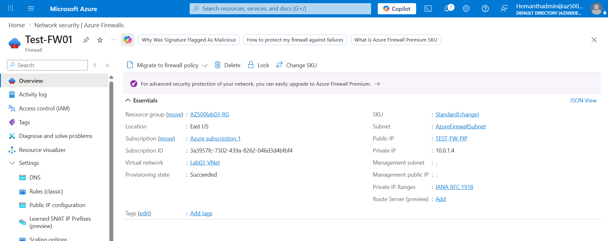

# 🔐 Azure Firewall Lab (AZ-500 Lab 03)

---

## 📌 Lab Scenario

This lab demonstrates how to deploy and configure **Azure Firewall** to control outbound traffic and enforce security policies.

### 🎯 Objectives

* Create secure network architecture using subnets
* Deploy Jump server and Workload server
* Force traffic through firewall using UDR
* Allow only specific outbound access (Bing)
* Block all other internet traffic

---

## 🏗️ Architecture



📌 **Why this design?**

* Segregation of workload and management layers
* Controlled access using Jump server
* Central inspection using Azure Firewall

---

## 🌐 Resource Topology


📌 This shows how all Azure resources are interconnected:

* Virtual Machines
* NICs
* NSGs
* Route Table
* Firewall

---

## ⚙️ Step 1: Virtual Network Setup

### What we did

* Created VNet: `Lab03-VNet`
* Address space: `10.0.0.0/16`

### Subnets:

* Workload-SN → `10.0.2.0/24`
* Jump-SN → `10.0.3.0/24`
* AzureFirewallSubnet → `10.0.1.0/24`

### Why

* Isolation between application and management traffic
* Azure Firewall requires a dedicated subnet

---

## 🖥️ Step 2: Virtual Machines Deployment

### 🔹 Srv-Work (Private VM)

* No Public IP
* Internal access only

### 🔹 Srv-Jump (Public VM)

* Public IP enabled
* Used as entry point

### Why

* Prevent direct exposure of internal workloads
* Use Jump server as a controlled access layer

---

## 🔗 Step 3: Connectivity Testing

### What we did

* Connected to Jump VM using public IP
* From Jump VM → connected to Workload VM using private IP


### Why

* Ensure internal communication works before applying firewall rules

---

## 🔥 Step 4: Azure Firewall Deployment



### What we did

* Deployed Azure Firewall in `AzureFirewallSubnet`
* Assigned Public IP


### Why

* Firewall acts as central inspection point
* Public IP allows outbound internet connectivity via firewall

---

## 🛣️ Step 5: Route Table (UDR)


### What we did

* Created route: `0.0.0.0/0`
* Next hop type: Virtual Appliance
* Next hop IP: `10.0.1.4` (Firewall private IP)
* Associated with Workload-SN

### Why

* Forces all outbound traffic through firewall
* Prevents direct internet access

---

## 🌐 Step 6: Firewall Rules

### 🔹 Application Rule (Allow Bing)


### What we did

* Allowed outbound HTTP/HTTPS to `www.bing.com`

### Why

* Demonstrates FQDN-based filtering

---

### 🔹 Network Rule (Allow DNS)


### What we did

* Allowed DNS traffic to:

  * `209.244.0.3`
  * `209.244.0.4`

### Why

* Required for domain name resolution
* Without DNS → application rules won’t work

---

## 🧪 Step 7: Validation

### ✅ Allowed Traffic


✔️ Successfully accessed Bing

---

### ❌ Blocked Traffic


```
Action: Deny. Reason: No rule matched.
```

### Why

* Firewall follows default deny principle

---

## 🔐 Key Learnings

* UDR forces traffic through firewall
* Azure Firewall follows **default deny model**
* DNS is mandatory for FQDN filtering
* Jump server improves security posture

---

## ⚠️ Common Mistakes

* Using firewall public IP instead of private IP in route
* Forgetting route table association
* Missing DNS rule

---

## 🚀 Real-World Improvements

* Enable diagnostic logs
* Integrate with Microsoft Sentinel
* Use Firewall Policy instead of classic rules

---

## 🧹 Cleanup

```powershell
Remove-AzResourceGroup -Name "AZ500lab03-RG" -Force
```

---

## 👨‍💻 Author

Hemanth – Cloud Security Learning Journey 🚀
