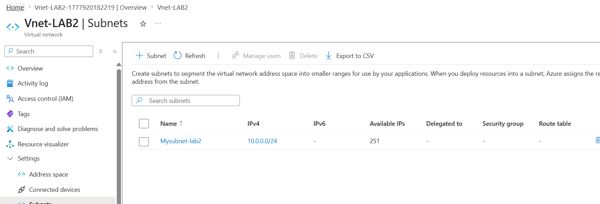
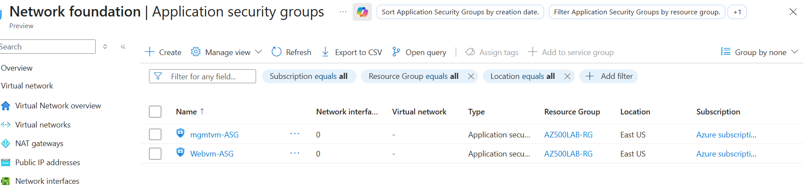

# 🔐 Azure Firewall Lab (AZ-500 Lab 03)

---

## 📌 Lab Scenario

This lab demonstrates how to deploy and configure **Azure Firewall** to control outbound traffic and enforce security policies.

### 🎯 Objectives

* Create secure network architecture using subnets
* Deploy Jump server and Workload server
* Force traffic through firewall using UDR
* Allow only specific outbound access (Bing)
* Block all other internet traffic

---

## 🏗️ Architecture


📌 **Why this design?**

* Segregates workloads into different subnets
* Uses Jump VM as a secure access point
* Centralizes traffic inspection through Firewall

---

## 🌐 Resource Topology


📌 Shows how all components are connected:

* VNet, Subnets
* NSGs, Route Table
* Firewall + Public IP

---

## ⚙️ Step 1: Virtual Network Setup



### What we did

* Created VNet: `Lab03-VNet`
* Address space: `10.0.0.0/16`

### Subnets:

* Workload-SN → `10.0.2.0/24`
* Jump-SN → `10.0.3.0/24`
* AzureFirewallSubnet → `10.0.1.0/24`

### Why we did this

* Separate workloads for security isolation
* Dedicated subnet required for Azure Firewall

---

## 🖥️ Step 2: Virtual Machines Deployment

### 🔹 Srv-Work (Private VM)

* No Public IP
* Internal access only

### 🔹 Srv-Jump (Public VM)

* Public IP enabled
* Used as secure entry point

### Why

* Prevent direct internet exposure of workload VM
* Use Jump server as controlled access layer

---

## 🔐 Step 3: NSG Configuration

### NSG Overview


### NSG Rules


### What we did

* Allowed RDP (3389) only from our IP to Jump VM
* Allowed internal VNet communication
* Denied all other inbound traffic

### Why

* Follows **least privilege principle**
* Protects VMs from unauthorized access

---

## 🧩 Step 4: Application Security Groups (ASG)



### Why

* Logical grouping of VMs
* Easier rule management in NSG

---

## 🔗 Step 5: Connectivity Testing

### RDP to Jump Server


### RDP to Workload VM


### What we verified

```
Your PC → Jump VM → Workload VM
```

### Why

* Ensures internal connectivity works before firewall enforcement

---

## 🔥 Step 6: Azure Firewall Deployment

### What we did

* Deployed Firewall in `AzureFirewallSubnet`
* Assigned Public IP

### Why

* Central inspection point for all outbound traffic

---

## 🛣️ Step 7: Route Table (UDR)


### What we did

* Created route: `0.0.0.0/0`
* Next hop: Firewall Private IP
* Associated with Workload-SN

### Why

* Forces all outbound traffic through firewall

---

## 🌐 Step 8: Firewall Rules

### Application Rule

* Allow: `www.bing.com`

### Network Rule

* Allow DNS:

  * `209.244.0.3`
  * `209.244.0.4`

### Why

* Application rule filters web traffic
* DNS rule is required for domain resolution

---

## 🧪 Step 9: Validation

### ✅ Allowed Traffic


✔️ Bing accessible

---

### ❌ Blocked Traffic


```
Action: Deny. Reason: No rule matched.
```

### Why

* Firewall follows **default deny model**

---

## 🌐 Additional Test


---

## 🔐 Key Learnings

* Forced tunneling using UDR
* Default deny firewall behavior
* Importance of DNS in firewall rules
* Secure jump host architecture

---

## ⚠️ Common Mistakes

* Using firewall public IP instead of private IP
* Not associating route table
* Missing DNS rule

---

## 🚀 Improvements

* Enable logging & monitoring
* Integrate with Sentinel
* Use Firewall Policy

---

## 🧹 Cleanup

```powershell
Remove-AzResourceGroup -Name "AZ500LAB08" -Force
```

---

## 👨‍💻 Author

Hemanth – Cloud Security Learning Journey 🚀
