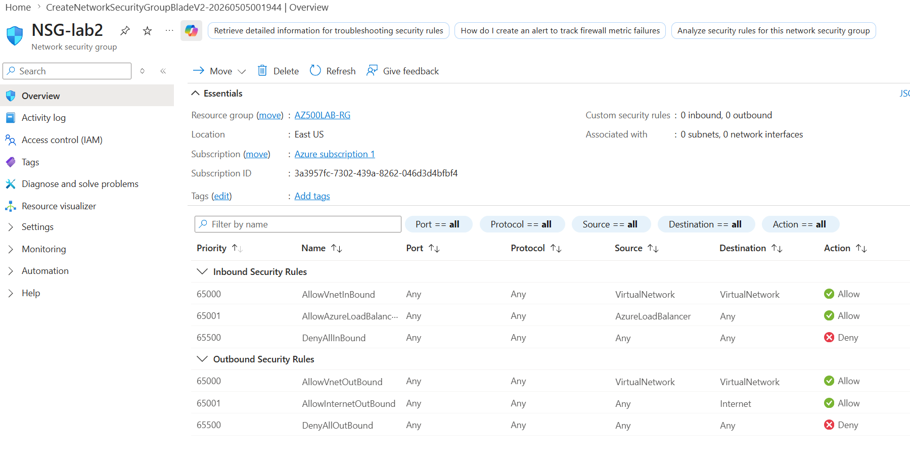
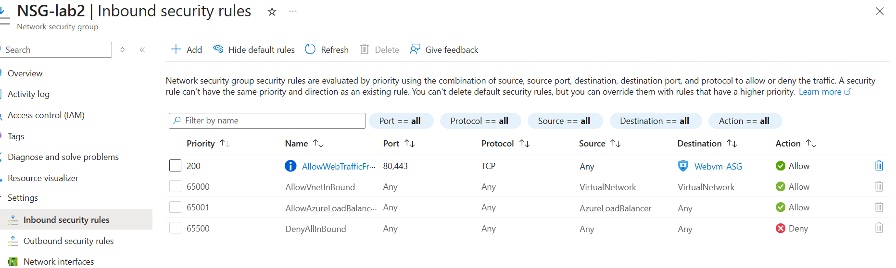
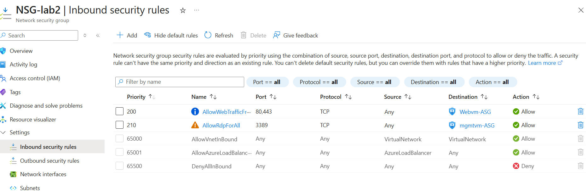
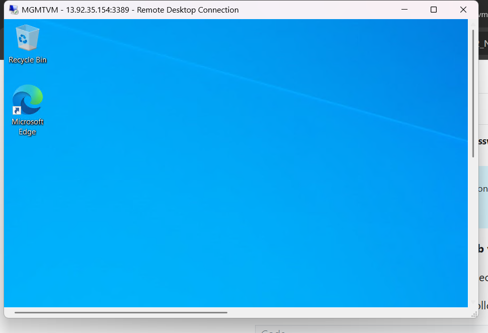
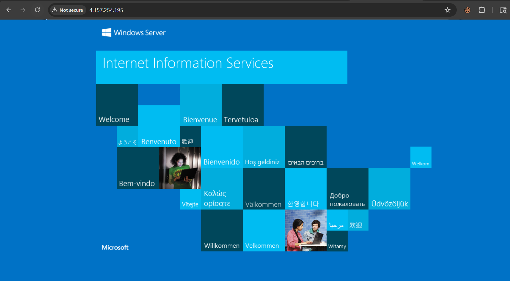

# 📌 AZ-500 Lab 02 – Network Security Groups (NSG) & Application Security Groups (ASG)

## 🎯 Lab Scenario

In this lab, I implemented a virtual network to simulate an organization with two types of servers:

- Web Servers (public-facing)
- Management Servers (administrative access)

### Requirements:

- Use Application Security Groups (ASG) to group servers
- Allow:
  - HTTP/HTTPS access to Web Servers
  - RDP access only to Management Servers
- Deny RDP access to Web Servers
- Use Network Security Groups (NSG) to control access

> Note: Both VMs have public IPs, but access is controlled using NSG rules.

---

## 🏗️ Architecture Overview

- VNet: `Vnet-LAB2`
- Subnet: `Mysubnet-lab2` (10.0.0.0/24)
- NSG: `NSG-lab2` (attached to subnet)
- ASGs:
  - `Webvm-ASG`
  - `mgmtvm-ASG`
- VMs:
  - Web VM
  - Management VM

---

## 🔹 Step 1: Create Virtual Network

Created a VNet with one subnet.

📸 Screenshot:

---

## 🔹 Step 2: Create Application Security Groups (ASG)

Created two ASGs:

- `Webvm-ASG` → Web Servers  
- `mgmtvm-ASG` → Management Servers  

📸 Screenshot:

---

## 🔹 Step 3: Create Network Security Group (NSG)

- Created NSG: `NSG-lab2`
- Associated it with the subnet

📸 Screenshot:

---

## 🔹 Step 4: Configure NSG Rules

### ✅ Allow Web Traffic

- Source: Any (Internet)
- Destination: `Webvm-ASG`
- Ports: 80, 443
- Action: Allow

---

### ✅ Allow RDP to Management Servers

- Source: Any (Internet)
- Destination: `mgmtvm-ASG`
- Port: 3389
- Action: Allow

📸 Screenshot:

---

## 🔹 Step 5: Deploy Virtual Machines

Deployed two VMs:

- Web VM
- Management VM

Associated them with ASGs:

- Web VM → `Webvm-ASG`
- Mgmt VM → `mgmtvm-ASG`

---

##  Step 6: Verification – RDP

- Connected to Management VM → ✅ Success  
- Attempted RDP to Web VM → ❌ Blocked

  !

---

##  Step 7: Install IIS on Web VM

Used Run Command → PowerShell:

powershell
Install-WindowsFeature -name Web-Server -IncludeManagementTools

## step 8:Access Web Server

- Opened browser
- Entered Web VM public IP
- Successfully accessed the default IIS web page

  

